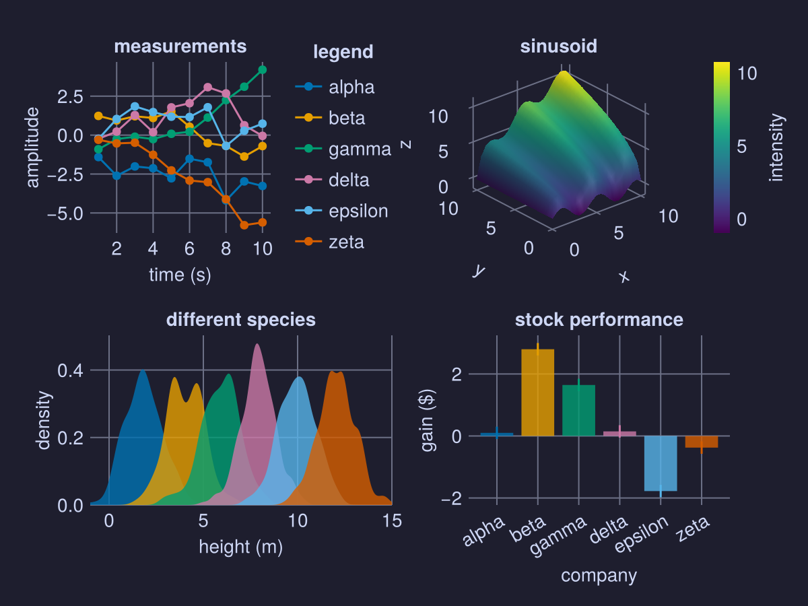
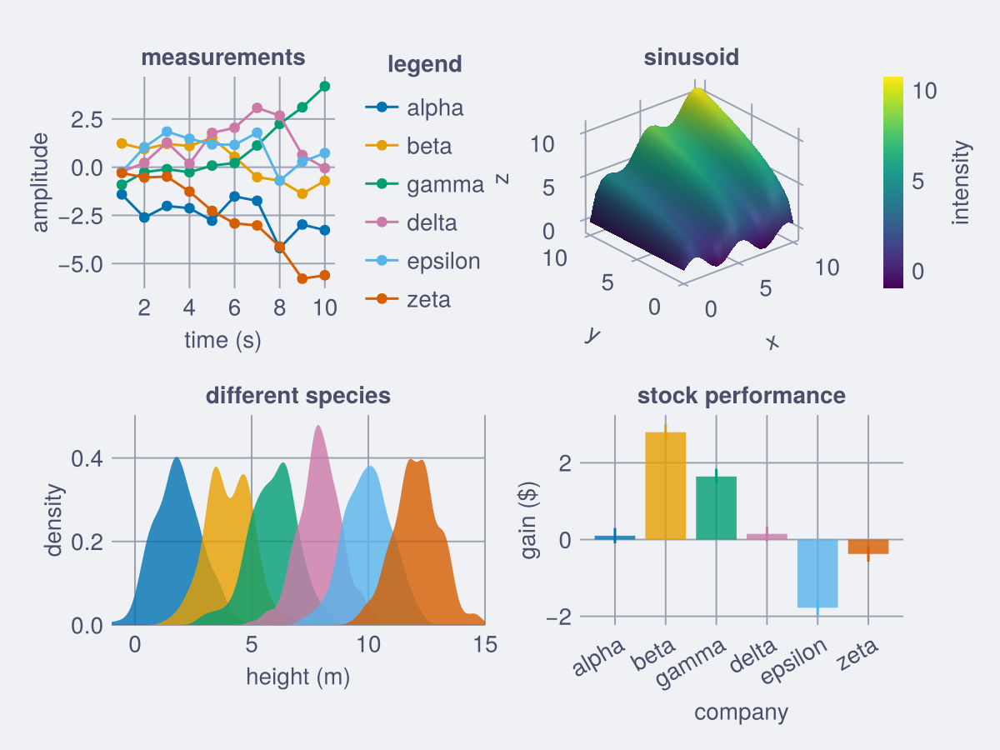
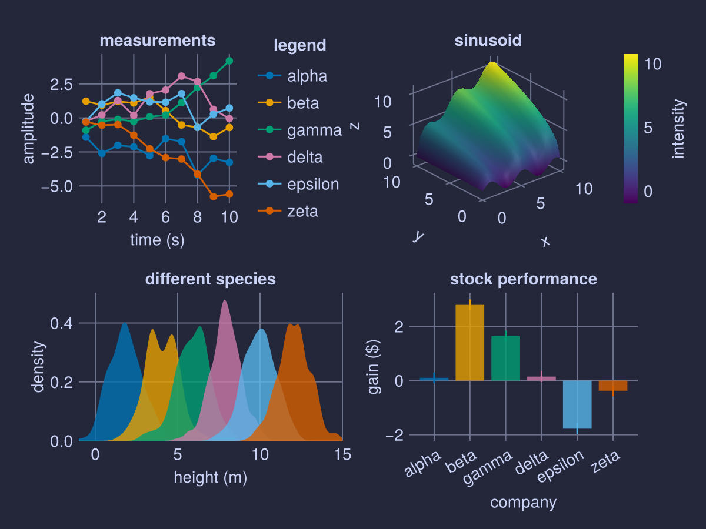

# CatppuccinMakieThemes

[](https://fgerick.github.io/CatppuccinMakieThemes.jl/dev/)
[](https://github.com/fgerick/CatppuccinMakieThemes.jl/actions/workflows/CI.yml?query=branch%3Amain)
[](https://codecov.io/gh/fgerick/CatppuccinMakieThemes.jl)

Provides [catppuccin themes](https://github.com/catppuccin) for the [Makie.jl](https://github.com/MakieOrg/Makie.jl) packages.

## Installation

```julia
import Pkg; Pkg.add(url="https://github.com/fgerick/CatpuccinMakieThemes.jl.git")
```

## Example

Example figure

```julia
using CairoMakie, CatppuccinMakieThemes
using Random


function demofigure()
    Random.seed!(2)

    f = Figure()
    ax = Axis(f[1, 1],
        title = "measurements",
        xlabel = "time (s)",
        ylabel = "amplitude")

    labels = ["alpha", "beta", "gamma", "delta", "epsilon", "zeta"]
    for i in 1:6
        y = cumsum(randn(10)) .* (isodd(i) ? 1 : -1)
        lines!(y, label = labels[i])
        scatter!(y, label = labels[i])
    end

    Legend(f[1, 2], ax, "legend", merge = true)

    Axis3(f[1, 3],
        viewmode = :stretch,
        zlabeloffset = 40,
        title = "sinusoid")

    s = surface!(0:0.5:10, 0:0.5:10, (x, y) -> sqrt(x * y) + sin(1.5x))

    Colorbar(f[1, 4], s, label = "intensity")

    ax = Axis(f[2, 1:2],
        title = "different species",
        xlabel = "height (m)",
        ylabel = "density",)
    for i in 1:6
        y = randn(200) .+ 2i
        density!(y)
    end
    tightlimits!(ax, Bottom())
    xlims!(ax, -1, 15)

    Axis(f[2, 3:4],
        title = "stock performance",
        xticks = (1:6, labels),
        xlabel = "company",
        ylabel = "gain (\$)",
        xticklabelrotation = pi/6)
    for i in 1:6
        data = randn(1)
        barplot!([i], data)
        rangebars!([i], data .- 0.2, data .+ 0.2)
    end

    f
end
```

### Mocha
```julia
CairoMakie.set_theme!(CatppuccinMakieThemes.Mocha)
demofigure()
```



### Latte
```julia
CairoMakie.set_theme!(CatppuccinMakieThemes.Latte)
demofigure()
```



### Macchiato
```julia
CairoMakie.set_theme!(CatppuccinMakieThemes.Macchiato)
demofigure()
```



### Frappe
```julia
CairoMakie.set_theme!(CatppuccinMakieThemes.Frappe)
demofigure()
```

